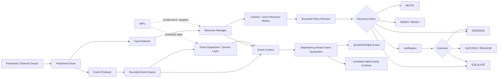

# Project Reference Guide

**Project:** Embedded Systems — Missed Opportunities in Simpler Areas

**Short Project Title:** Zero-Heap Context-Aware Peripheral Recovery with Event Quarantine

**Canonical Repository:** `SujitSaiY2007/embedded-runtime-resilience`

**Document Purpose:** Shared technical reference for the project team. This document explains what the project is, why it exists, what has been decided, what is currently being built, what is novel *as a research hypothesis*, and what remains to be completed.

**Status:** Phase 1 — Preparation / System Design and Experimental Planning. Phase 1E — Formal Specification & Experimental Design is active.

**Last Updated:** 2026-08-24

---

## 1. Project Topic

### Full Research / Development Topic

> **Design and Implementation of a Lightweight Zero-Heap Context-Aware Peripheral Recovery Policy with Event Quarantine for Resource-Constrained MPU-Enabled Event-Driven MCU Firmware**

### Short Working Title

> **Zero-Heap Context-Aware Peripheral Recovery with Event Quarantine**

The topic is frozen for development. It should not be restarted or replaced unless implementation evidence, experiments, or stronger prior-art evidence shows that the mechanism is technically invalid, infeasible, untestable, or materially contradicted.

---

## 2. Project Domain

The project belongs to **Embedded Systems Research**, specifically:

- Resource-constrained microcontroller (MCU) firmware
- Embedded fault tolerance and runtime resilience
- Peripheral fault recovery
- Event-driven firmware architecture
- Deterministic resource management
- Fault containment and service preservation
- MPU-supported memory/component isolation
- Experimental embedded-systems evaluation
- Lightweight formal reasoning for firmware policies

The broader research theme is **"Missed Opportunities in Simpler Areas of Embedded Systems."** The project deliberately investigates whether a small, carefully designed mechanism can solve a real embedded-systems problem without introducing an unnecessarily large framework.

---

## 3. Problem We Are Solving

A peripheral fault in an embedded system does not necessarily mean that the entire firmware should stop or reset.

A simple recovery strategy may repeatedly retry an operation, reset the peripheral, or eventually reset the whole system. These strategies can recover the peripheral, but they may also interrupt or destroy unrelated work that was already queued and still valid.

The project therefore asks a narrower question:

> **Can a small deterministic recovery manager identify the fault context, choose an appropriate bounded recovery action, and isolate only the fault-associated event while allowing unrelated valid event-driven work to continue when it is safe to do so?**

The goal is not merely to "recover a failed peripheral." Peripheral recovery is already an established field. The goal is to reduce **collateral service disruption** caused by recovery itself.

---

## 4. Core Research Question

> **Can a compact deterministic software-only recovery policy for event-driven MCU firmware use peripheral fault context and short recovery history to select a bounded recovery action while quarantining the fault-associated event, preserving unrelated valid queued events, and maintaining acceptable CPU/RAM/Flash overhead on an MPU-enabled resource-constrained MCU?**

This question contains the main elements of the project:

1. Compact
2. Deterministic
3. Software-only recovery policy
4. Event-driven MCU firmware
5. Fault context
6. Short recovery history
7. Bounded recovery action
8. Fault-associated event quarantine
9. Preservation of unrelated valid work
10. Acceptable resource overhead

---

## 5. Implementation Decided Upon

The system will be implemented as a **lightweight recovery manager integrated into a cooperative/event-driven MCU firmware architecture**.

### 5.1 Zero-Heap Architecture

The recovery manager and reference firmware will use **no runtime dynamic memory allocation**.

Therefore:

- No `malloc/free` dependency
- No dynamically resized queues
- No dynamically allocated recovery objects
- No heap-based policy state
- Static allocation only
- Bounded queues
- Fixed policy tables
- Bounded recovery records

Zero-heap is an architectural constraint, **not a novelty claim**.

### 5.2 Context-Aware Recovery

The recovery manager will maintain a compact bounded context. Current candidate variables are:

1. Fault class
2. Fault recurrence
3. Attempt count
4. Previous action
5. Previous outcome
6. Service criticality
7. Event dependency status
8. Pending independent workload

These variables remain subject to experimental challenge. A variable should remain only if it materially affects recovery decisions.

### 5.3 Bounded Recovery Actions

The effective action set is:

1. **RETRY**
2. **REINIT_OR_RESET**
3. **DEGRADE**
4. **ESCALATE**

Reinitialization and peripheral reset will remain separate only if experiments show that the selected peripheral implementation gives them meaningfully different semantics.

Every fault episode must terminate in one of:

- SUCCESS
- DEGRADED
- ESCALATED

within a declared finite transition bound.

### 5.4 Event Quarantine

The key service-preservation mechanism is **dependency-aware event quarantine**.

Suppose the event queue contains:

`E1 -> E2 -> E3 -> E4 -> E5`

and `E3` is associated with a peripheral fault.

The intended behavior is:

- `E3` becomes **QUARANTINED**.
- `E3` is retained but is not executable.
- `E4` and `E5` may continue only when they are not fault-associated, have no unsatisfied dependency on `E3`, do not rely on invalid shared state, required ordering permits execution, and the active recovery action does not prohibit them.

Quarantine means:

> **Retained but non-executable until an explicit permitted transition.**

It does not mean deletion, and it does not mean blindly flushing the peripheral's entire queue.

### 5.5 MPU Usage

The primary target platform is an **MPU-enabled MCU**.

The MPU may be used for:

- Containment
- Protected recovery state
- Memory-region isolation
- Component/service separation where experimentally useful

The MPU itself is **not claimed as novel**. If MPU experimentation does not materially strengthen the experiment, it remains a secondary configuration rather than dominating the project.

### 5.6 Firmware Architecture

The reference firmware is intended to remain:

- Cooperative
- Event-driven
- Lightweight
- Statically bounded
- Deterministic where practical
- Independent of a heavyweight RTOS as a mandatory dependency

---

## 6. High-Level System Architecture



### Architecture in simple terms

**Normal operation:** peripherals generate work -> events enter the bounded queue -> services process the events.

**Fault:** a peripheral operation fails -> the fault is detected and classified -> the associated event is quarantined -> the recovery manager examines context/history -> one bounded recovery action is selected -> recovery is verified -> the quarantined event is released, degraded, or escalated -> unrelated safe events continue whenever the dependency rules allow it.

---

## 7. Event Model

Each event may contain or be associated with:

- Event identity
- Event type
- Producer
- Consumer/service
- Peripheral association
- Transaction identity
- Criticality
- Dependency
- Ordering requirement
- Current state
- Fault association
- Retry/recovery information

### Dependency classes

1. **Independent** — event does not depend on the failed event/service state.
2. **Ordered** — event requires another event to execute before it.
3. **Coupled/Transactional** — event belongs to a transaction or shared state where isolated execution may be unsafe.

The central rule is that **event preservation means correct execution, not merely remaining in memory**.

---

## 8. Fault Model

The initial controlled fault model focuses on reproducible faults such as:

- Transaction timeout
- Forced non-response/error
- Repeated communication failure
- Invalid peripheral-state condition
- Event-triggered service failure

Hardware-relevant faults will be added as a later validation layer where practical.

Naturally occurring faults are optional and are not the primary experimental source.

### Initial peripheral testbed

- **Primary interface:** I2C
- **Secondary interface:** SPI
- **Diagnostic/control interface:** UART/USART
- Prefer one inexpensive external peripheral capable of supporting both I2C and SPI for the initial physical testbed.
- CAN is currently deferred.

---

## 9. Policy State Machine

The current policy abstraction is:

```text
Action = Policy(
    FaultContext,
    RecoveryHistory,
    EventContext,
    ServiceCriticality
)
```

Initial state flow:

```text
NORMAL
  |
  v
FAULT_DETECTED
  |
  v
CLASSIFIED
  |
  v
QUARANTINED
  |
  v
RECOVERING
  |
  v
VERIFY
  |
  +------> SUCCESS / REASSESS
  |
  +------> RELEASED
  |
  +------> DEGRADED
  |
  +------> ESCALATED
```

This state machine is a design abstraction and remains subject to refinement during formal specification and experiments.

---

## 10. Proposed Policy Variants for Ablation

The current experimental variants are:

| Variant | Description |
|---|---|
| **P0** | Fixed retry |
| **P1** | Context without recovery history |
| **P2** | Context + short recovery history |
| **P3** | Context + history + dependency-aware event quarantine |

This allows us to determine **which part of the proposed mechanism actually contributes to the measured benefit** instead of simply comparing a large system against a simple baseline.

---

## 11. Baselines

The main experimental baselines are:

### Baseline 1 — Fixed Retry

```text
FAULT
  -> RETRY N TIMES
  -> SUCCESS / ESCALATE
```

### Baseline 2 — Fixed Retry + Reset/Reinitialization

```text
FAULT
  -> RETRY N TIMES
  -> RESET / REINITIALIZE
  -> CONTINUE / ESCALATE
```

### Proposed Mechanism

```text
FAULT
  -> CONTEXT / HISTORY CLASSIFICATION
  -> EVENT QUARANTINE
  -> BOUNDED ACTION SELECTION
  -> VERIFY
  -> RELEASE / DEGRADE / ESCALATE
```

Sophisticated prior systems such as Phoenix and Karma are treated as **related work and architectural positioning**, not as simplistic baselines.

---

## 12. Novelty: What We Can and Cannot Claim

### What is NOT individually novel

The following are established concepts and must not be presented as inventions by themselves:

- Zero-heap/static allocation
- MPU isolation
- Peripheral recovery
- Event queues
- Event quarantine
- Context-aware recovery
- Retry/reset/reinitialization
- Graceful degradation
- Recovery state machines
- Formal invariants

### Current novelty hypothesis

The research contribution is the **specific integrated mechanism and its measured trade-off**:

> A deliberately small, deterministic, zero-heap recovery policy for cooperative/event-driven MCU firmware that uses local fault context and short recovery history to choose a bounded recovery action while explicitly quarantining the fault-associated event and preserving unrelated valid event-driven service when dependency and ordering conditions allow it.

The hypothesis is strengthened by its resource constraints and experimental discipline:

- no runtime heap;
- bounded memory;
- bounded recovery actions;
- bounded transitions;
- explicit event dependencies;
- measurable service-preservation behavior;
- MCU-level resource measurements.

**Important:** this is a novelty hypothesis, not a confirmed patentability or novelty conclusion.

---

## 13. Prior-Art Position

The project has already been subjected to a focused academic, patent, vendor, and implementation prior-art attack.

Important lessons include:

- Phoenix demonstrates resource-constrained peripheral recovery.
- Karma demonstrates recovery of asynchronous peripheral operations in embedded systems.
- Device-driver recovery literature demonstrates isolation and policy-driven recovery.
- Context-aware embedded health management demonstrates that context-dependent recovery is established.
- Graceful degradation and selective recovery are established engineering concepts.
- Recent patent activity demonstrates that selective peripheral recovery and peripheral fault isolation remain active areas.

Therefore, the project must differentiate itself through the **small-MCU, zero-heap, deterministic, event-service-preservation combination**, and then test whether that combination actually provides a useful measurable advantage.

A close one-to-one prior-art match or poor experimental results would require narrowing or rejecting the hypothesis.

---

## 14. Hardware Stack

### Primary MCU / Development Board

**STM32U575ZI on NUCLEO-U575ZI-Q**

Purpose:

- MPU-enabled MCU experimentation
- Real firmware execution
- Peripheral communication
- Interrupt/timing measurements
- RAM/Flash measurement
- Physical validation of the recovery mechanism

### Fallback Board

**Renesas EK-RA6M5**

This is a fallback rather than the primary target.

### Initial Peripheral Layer

- I2C — primary test interface
- SPI — secondary test interface
- UART/USART — diagnostic/control interface
- One inexpensive external I2C/SPI-capable peripheral for the initial testbed

### Physical Setup

Expected minimal setup:

- NUCLEO-U575ZI-Q
- Breadboard
- Jumper wires
- One inexpensive I2C/SPI-capable peripheral

### Hardware Budget

Initial target: approximately **₹3,100–₹3,500**, subject to actual availability and pricing.

The project deliberately avoids unnecessary early purchases such as a second MCU, oscilloscope, expensive logic analyzer, CAN hardware, custom PCB, FPGA, or unrelated sensors unless experiments demonstrate a genuine need.

---

## 15. Software / Development Stack

### Confirmed software roles

The project currently requires:

- MCU firmware development environment/toolchain
- Host-PC development environment
- Host-side event-queue simulation
- Fault modelling and injection logic
- Automated testing
- Formal/state-transition reasoning
- Experiment logging and data analysis

### Important scope rule

The exact IDE, compiler/toolchain, RTOS usage, formal-verification tool, and analysis framework should be recorded when selected. They are **not treated as frozen project decisions unless explicitly recorded in the repository**.

The core architecture does **not** require a heavyweight RTOS.

The reference implementation is intended to remain lightweight, event-driven, statically bounded, and suitable for constrained MCU execution.

---

## 16. Formal Properties / Invariants Under Development

Phase 1E.1 is currently focused on deriving the smallest defensible formal specification from the actual architecture.

Candidate properties include:

### P1 — Quarantine Safety

If an event is `QUARANTINED`, it must not execute until an explicit permitted release/reclassification transition occurs.

Target:

```text
QuarantineViolation = 0
```

### P2 — Unrelated-Event Preservation

For an isolated fault associated with event `Ei`, an independent valid event `Ej` must not be removed solely because of `Ei`.

This is subject to dependency, ordering, shared-state validity, and recovery-action safety.

### P3 — Queue Boundedness

```text
0 <= |Q| <= Qmax
```

Quarantine storage must also remain bounded.

### P4 — Recovery Termination

Every fault episode must reach `SUCCESS`, `DEGRADED`, or `ESCALATED` within a finite declared transition bound.

### P5 — Ordering Preservation

For events requiring ordering:

```text
Ei ≺ Ej  =>  Exec(Ei) ≺ Exec(Ej)
```

unless explicitly defined quarantine/reclassification semantics legally alter that relationship.

### P6 — Fault Association Correctness

The recovery manager must not assign a fault to an unrelated event without satisfying the defined association rule.

Association levels under consideration:

1. Exact event/transaction
2. Service
3. Peripheral
4. Unknown/ambiguous

Ambiguous association must trigger conservative behavior.

### P7 — Bounded Recovery Storage

Recovery history, recovery records, and quarantine storage must remain statically bounded.

The relationship between queue capacity, quarantine capacity, history capacity, and recovery-record capacity must be explicitly defined.

The project will use the lightest formal method that provides credible evidence. Full formal verification of the firmware is not a project requirement.

---

## 17. Experimental Plan

Before interpreting results, the experiment must define:

- Workload composition
- Event mix
- Queue capacity
- Fault types
- Fault-injection positions
- Fault frequency
- Fault recurrence patterns
- Number of repetitions
- Warm-up procedure
- Reset procedure
- Configuration parameters
- Timing measurement points
- Logging format
- Deterministic seeds if randomness is introduced
- Experiment identifiers
- Reproducibility procedure

Every baseline and policy variant must receive:

- identical workload;
- identical fault schedule;
- identical measurement conditions.

### Host vs Physical Results

The project must explicitly distinguish:

**HOST / SIMULATION RESULTS**

from:

**PHYSICAL MCU RESULTS**

Host results must never be presented as physical embedded measurements.

---

## 18. Metrics

Primary metrics include:

- Fault detection latency
- Recovery latency
- Service-restoration latency
- Recovery success rate
- Whole-system reset count
- Unrelated-event preservation rate
- Quarantine violations
- Lost events
- Duplicated events
- Queue occupancy
- CPU overhead
- RAM footprint
- Flash footprint
- Recovery-state count
- Energy impact where practical

The central outcome is not simply whether recovery succeeds. The experiment must determine whether the proposed policy **reduces collateral disruption while keeping resource overhead acceptable**.

---

## 19. Current Project State — 2026-08-24

### Phase

**Phase 1 — Preparation / System Design and Experimental Planning**

### Current Sub-Phase

**Phase 1E — Formal Specification & Experimental Design**

### Status

**ACTIVE — Phase 1 is not yet complete.**

### Completed

- Research-space decomposition
- Candidate comparison
- Deep prior-art attack
- Topic selection and freeze
- Zero-heap architectural constraint
- Event-quarantine integration
- MPU role definition
- MCU/board selection
- Peripheral testbed direction
- Formal event model
- Recovery policy design

### Current immediate task

**Phase 1E.1 — Formal Properties / Invariants**

The immediate goal is to derive, challenge, simplify, and formally specify the smallest useful set of invariants from the actual event/recovery architecture.

### Remaining Phase 1 work

1. Complete 1E.1 formal properties/invariants
2. Complete 1E.2 baseline definitions
3. Complete 1E.3 experimental protocol
4. Complete 1E.4 measurement/data schema
5. Complete 1E.5 Phase-1 design review and closure
6. Only after these gates pass, begin firmware implementation

---

## 20. Hardware Reality

No physical MCU board should be assumed to have been acquired unless acquisition is explicitly verified.

The laptop/PC can currently support:

- Development
- Host simulation
- Event-queue testing
- Fault modelling
- Formal reasoning
- Automated testing
- Analysis

Physical hardware is required for strong final claims about:

- MPU behavior
- Interrupt timing
- Peripheral behavior
- Actual RAM/Flash footprint
- Execution overhead
- Hardware-relevant faults

**Never invent physical measurements.**

---

## 21. What the Final System Should Demonstrate

The final system should allow a controlled comparison between conventional recovery and the proposed policy.

Conceptually:

```text
                  NORMAL EVENT-DRIVEN OPERATION
                              |
                              v
                    +--------------------+
                    |  Peripheral/Event  |
                    |      Activity      |
                    +---------+----------+
                              |
                         Fault occurs
                              |
                              v
                    +--------------------+
                    | Fault Detection &  |
                    |     Association    |
                    +---------+----------+
                              |
                              v
                    +--------------------+
                    | Quarantine Fault-  |
                    | Associated Event   |
                    +---------+----------+
                              |
                              v
                    +--------------------+
                    | Context + History  |
                    | Recovery Policy     |
                    +---------+----------+
                              |
                  +-----------+-----------+
                  |           |           |
                  v           v           v
               RETRY      REINIT/RESET  DEGRADE
                  \           |           /
                   \          |          /
                    +---------+---------+
                              |
                              v
                         Verification
                              |
             +----------------+----------------+
             |                                 |
             v                                 v
        Release/Success                 Degrade/Escalate
             |
             v
     Continue safe unrelated
       queued event work
```

The experimental question is whether this structure can reduce service disruption compared with simpler fixed recovery strategies without imposing unacceptable MCU overhead.

---

## 22. What We Must NOT Do

1. Do not restart topic selection.
2. Do not add unrelated resilience features.
3. Do not equate complexity with novelty.
4. Do not claim patentability.
5. Do not claim individual ingredients as novel.
6. Do not invent hardware measurements.
7. Do not treat simulation as physical validation.
8. Do not implement a large framework before the policy is specified.
9. Do not use unconditional queue flushing as the event-quarantine mechanism.
10. Do not assume every queued event is safe merely because it is unrelated to the faulting peripheral.
11. Do not hide negative experimental results.
12. Do not expose potentially patent-sensitive implementation details unnecessarily.

---

## 23. Team Working Model — Addition of a Second Contributor

The project is transitioning from a solo workflow to a **two-contributor research/engineering workflow**.

The project architecture and technical decisions remain shared. No contributor should silently change a frozen architectural constraint or research claim.

### Recommended division of responsibility

**Contributor 1 — Project / Research Lead**

- Overall architecture
- Research question and scope
- Prior-art positioning
- Final design decisions
- Experimental interpretation
- Repository continuity
- Final integration

**Contributor 2 — Engineering / Experimental Contributor**

- Prototype implementation after Phase 1 closure
- Peripheral testbed integration
- Fault-injection implementation
- Test automation
- Measurement collection
- Reproducibility support
- Documentation of implementation observations

These are working-role suggestions, not permanent ownership boundaries. Both contributors should understand the complete system well enough to review each other's work.

### Team rule

Any consequential change to:

- research question;
- architecture;
- fault model;
- event semantics;
- recovery actions;
- formal properties;
- baselines;
- experimental methodology;
- novelty claims

must be recorded in the repository decision/state records.

---

## 24. Phase-Gate Rule

**Phase 1 is not complete yet.**

Firmware implementation should not begin at large scale until the following are closed:

- Formal properties/invariants
- Baseline definitions
- Experimental protocol
- Measurement/data schema
- Technical feasibility review
- Resource feasibility review
- Experimental feasibility review
- Falsifiability review
- Measurement sufficiency review
- Baseline fairness review
- Prior-art consistency review
- Scope-discipline review
- Patent/research disclosure discipline review

Only then:

```text
PHASE 1 = COMPLETE
        |
        v
IMPLEMENTATION PHASE
```

---

## 25. One-Paragraph Explanation for a New Team Member

We are building a small embedded-firmware recovery system for an MPU-enabled microcontroller. When a peripheral operation fails, instead of blindly retrying, resetting the peripheral, or disrupting the whole event queue, our recovery manager will look at the fault context, short recovery history, event dependencies, and service criticality. It will choose one of a small number of bounded recovery actions and quarantine the event associated with the fault. Unrelated valid events should continue only when their dependencies and ordering make that safe. The entire mechanism must use statically bounded memory with no runtime heap allocation. We will compare this approach experimentally against fixed retry and retry-plus-reset baselines, measuring recovery performance, service preservation, correctness, CPU/RAM/Flash overhead, and other relevant metrics on both host simulation and the physical MCU. The project is not claiming that any individual ingredient is novel; the research hypothesis is that this specific lightweight integrated mechanism can provide a measurable service-preservation advantage under severe embedded resource constraints.

---

## 26. Source of Truth

This guide is a high-level team reference. It does not replace detailed research records.

For authoritative technical decisions, use:

1. `PROJECT_MANUAL.md`
2. `PROJECT_STATE.md`
3. `CURRENT_HANDOFF.md`
4. `DECISION_LOG.md`
5. Relevant files under `research/`

The GitHub repository remains the canonical continuity mechanism for the project.

---

## 27. Current Starting Point for the Next Work Session

> **Phase 1E.1 — Formal Properties / Invariants**
>
> Recover the repository state, derive the formal properties from the actual event and recovery architecture, challenge every candidate invariant, remove redundant or untestable properties, add only genuinely necessary properties, choose the lightest defensible formal-reasoning method, and record the resulting specification before moving to baselines, experimental protocol, measurement schema, and Phase-1 closure.
